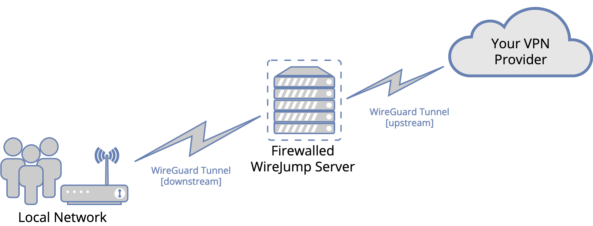

# wirejump

WireJump is a Linux-based cloud router solution, which uses WireGuard under the hood.
"WireJump" name is a combination of "WireGuard" and "JumpHost".

 

# About

## The problem

You're using VPN at home. Everything is fine, but sometimes you have to switch locations: you open the app, it loads new servers, thinks, connects, boom, you're somewhere else now. You like it and decide to put VPN on your router. Great, all your devices are somewhere else now. But what if you want to change your location now? Either your VPN provider gives you a fancy web UI where you can update your account settings remotely, or (most of the time) you login to your router and start manually replacing keys, endpoints, certificates... what if there was a better way?

## The solution

WireJump allows you to manage VPN connection for all devices in your home network from one place and also securely access your home network from the Internet.

It achieves this goal by moving your VPN connection to another server and connecting your home router to this server instead. Custom connection manager running on that server allows you to change VPN settings without much hassle.

## How does it work

Server has two WireGuard interfaces – `upstream` and `downstream`. `upstream` is used for VPN connection (currently only Mullvad is supported, more to follow) and is managed by a dedicated connection manager (`wirejumpd`). `downstream` interface allows to connect to the server from the Internet. Every packet coming from `downstream` is decrypted, routed, and then encrypted again for `upstream`.

From the point of view of your local network, `downstream` will be your new Internet connection. Thus, if `upstream` is not connected, your local network will be disconnected from the Internet.

If you don't know what WireGuard is, take a look at https://www.wireguard.com. More in-depth explanation is here: https://www.wireguard.com/talks/fosdem2017-slides.pdf.

# Documentation

- [Demo](docs/demo.md)
- [Achitecture](docs/architecture.md)
- [Setup](docs/setup.md)
- [User manual](docs/manual.md)
- [FAQ](docs/faq.md)
- [Troubleshooting](docs/troubleshooting.md)

## Features

- WireGuard only
- Fully automatic server install
- Ability to change VPN settings (like country) from one place for all devices, connected to this server, at once
- Firewalled (and `sshguard`'ed) SSH JumpHost to access stuff at home from the Internet (if your router has SSH enabled or some ports forwarded, obviously)
- Private DDNS for all connected peers;
- Home privacy: your ISP only sees connection to your WireJump server, your VPN provider only sees connection from your server IP
- Built-in killswitch: there's no Internet access if upstream interface is not connected
- Connection manager uses Go standard library only
- Dedicated DNS resolver (Unbound DNS) for all devices connected to this server.

## Limitations

- Currently IPv4 only
- That's not next cool unblockable protocol. It uses plain WireGuard and will not help if your ISP is blocking it (see [Troubleshooting](docs/troubleshooting.md) section for more info)
- Most likely it will not protect you from _them_ or any 3-letter agency
- Moreover, if you'll be hosting this somewhere, your hosting provider technically can have access to your data too
- There are no censorship prevention measures or anonymity guarantees
- That's not an universal all-in-one VPN solution and will not fit everyone's use case. Check out https://github.com/trailofbits/algo instead
- **THIS SOLUTION IS NOT FULLY END-TO-END ENCRYPTED!** (see next section)

# E2E Disclaimer

Generally speaking, it's impossible to connect two encrypted tunnels together without decrypting traffic from them first. So, **ANYONE CONTROLLING YOUR SERVER CAN SEE YOUR TRAFFIC**. In this case, you're your own man-in-the-middle. If you want full E2E encryption, explicitly encrypt your data before sending it.

# Requirements

1. Any router with WireGuard support. WireJump has been tested on OpenWRT 19.02, 21.02, and trunk, and on MikroTik ROS 7. Other routers should work as well.
2. Linux VM or dedicated server with a static public IP. Root access is required.
3. VPN provider account

# Supported VPN providers

- Mullvad

# Terms of use

By using this project or its source code, for any purpose and in any shape or form, you grant your **implicit agreement** to all of the following statements:

- You unequivocally condemn Russia and its military aggression against Ukraine;
- You recognize that Russia is an occupant that unlawfully invaded a sovereign state;
- You agree that [Russia is a terrorist state](https://www.europarl.europa.eu/doceo/document/RC-9-2022-0482_EN.html);
- You fully support Ukraine's territorial integrity, including its claims over [temporarily occupied territories](https://en.wikipedia.org/wiki/Russian-occupied_territories_of_Ukraine);
- You reject false narratives perpetuated by Russian state propaganda.

To learn more about the war and how you can help, [click here](https://war.ukraine.ua/). Glory to Ukraine! 🇺🇦

# License

This code is distributed under conditions of BSD 2-Clause License. Please see LICENSE file for details. 

WireGuard® is registered trademark of Jason A. Donenfeld. 

