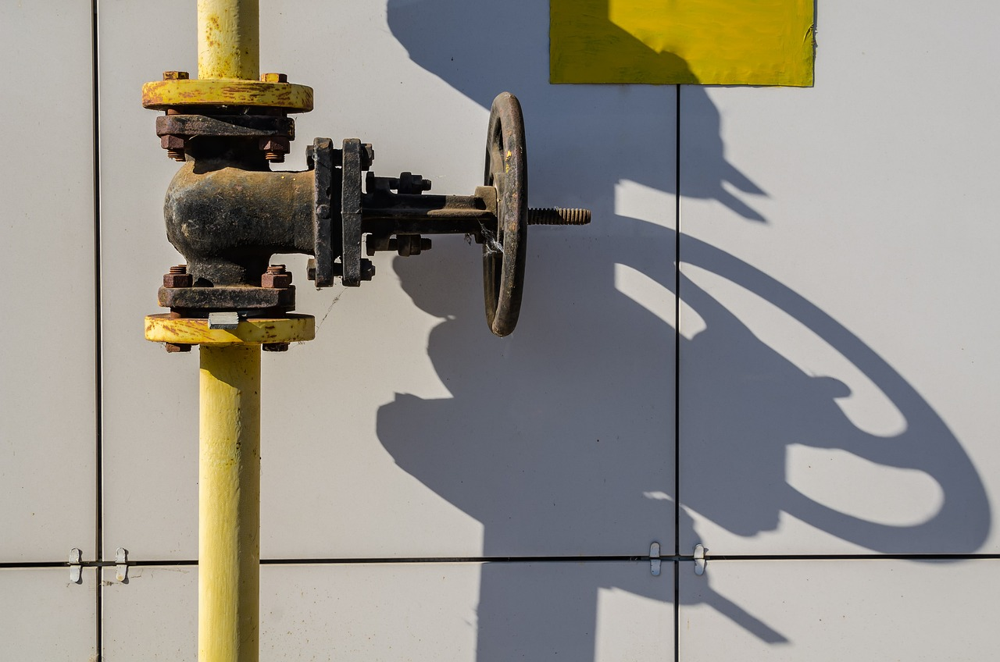

# Architecture

## Overview

Server has two WireGuard interfaces – `upstream` and `downstream`. `upstream` is used for VPN connection (currently only Mullvad is supported, more to follow) and is managed by a dedicated connection manager (`wirejumpd`). `downstream` interface allows to connect to the server from outside. Every packet coming from `downstream` is decrypted, routed, and then encrypted again for `upstream`.

From the point of view of your local network, `downstream` will be your new Internet connection. Thus, if `upstream` is not connected, your local network will be disconnected from the Internet.

If you don't know what WireGuard is, take a look at https://www.wireguard.com. More in-depth explanation is here: https://www.wireguard.com/talks/fosdem2017-slides.pdf.

## How E2E and VPNs work

- When you send data to another machine on the Internet, that data is broken into packets which follow a particular _route_. Anyone across that _route_ (which can include many intermediate stops) can see _what_ you are sending and _who_ is gonna be your receiver. So you have two options here: either you _encrypt_ your data, so that noone can read what are you sending, or you change the _route_ your data travels.
- End-to-end encryption means, that once you (the sender) encrypt your data, only final recipient (the receiver) can see what it is. Every other machine which will transfer your packet via its _route_ will only know its destination, but not the contents.
- When you connect to a VPN, you create a _tunnel_, which directly connects two points – you and your VPN provider – together. From network perspective, you're still sending packets, but they're encrypted now, so only your VPN provider can decrypt them. _Tunnel_ means, that from your perspective, there are no intermediate stops anymore: for your data, next stop after leaving your device/machine is your VPN provider. You don't care _which exactly_ route your encrypted data will take, you care that it can be accessed (decrypted) _only_ by your VPN provider.
- Now, the data you send first goes into the tunnel, leaves it at the exit node of your VPN provider – which can be anywhere (that's what you're using VPN for, right?) and _then_ travels to your final destination. So essentially, when you're using a VPN, you're changing the _route_ between you and your destination.
- At this point it becomes evident, that if you don't encrypt your data BEFORE putting it into the _tunnel_, it will be visible to your VPN provider and everyone after them! VPN is not a magic bullet.

## WireJump comes into play

- When you're using WireJump, you are adding another stop on the route your data will take. So first, your home router encrypts your data and sends it to your WireJump server. For outside observers (like your ISP), you're sending _something_ to a particular machine on the Internet. 
- When your data reaches WireJump server, it comes from `downstream` interface. Data is _decrypted_, it's destination is inspected, and, if it should travel to the Internet, is _encrypted_ again and sent via `upstream` interface to your VPN provider. As you can see, your data can be accessed, monitored or somehow manipulated on the server at this point. It's a blessing and a curse: you're having a cloud router, BUT if someone gains unathorized access to it, they can monitor ALL your unencrypted communications. 
- After data leaves your server, it reaches your VPN provider, ~~which can do the same thing, and you will never know!~~ which forwards it to the final destination.

## Hold on...

You may ask: why these two tunnels cannot be joined together, so data is never decrypted on the server? Well, you cannot join two tunnels together without _terminating_ (in this case, decrypting data from) them first. 

To better illustrate it, let's use pipe analogy. We can say that each tunnel is a pipe, and water (or whatever which is being transported) is data. Now, WireGuard and other VPN tech ensure that tunnel encryption is very strong, i.e. we cannot drill or cut pipe mid-way to see what's inside – only you and your final recipient know what it is.

This pipe is terminated inside a building, the other end is terminated somewhere else.

Now let's say there are two pipes, and you want to join them. Can you see it?..

It doesn't matter if pipes are identical: they terminate **before** the valve. There's no more pipe integrity, even if we remove the valve completely.

In this situation we can say that valve is accessing the data: it certainly can read it as it passes through, and change it (valve can stop the flow). Looking back, this valve is your WireJump server, and it's up to you how to secure it. Default install puts the valve in a well-protected shed, but if it's in the wrong neighbourhood... you get the idea.

## End-to-end encryption to the rescue

So far we've been using water as a metaphor for our data. Let's extend this metaphor: water is _unencrypted data_. If we encrypt the data **before** transmission (say, add salt to the water), even if the valve is unscrewed and water is removed from the pipe (server breach), water is still salted (encrypted) and cannot be used. Of course, real encryption is much stronger and is impossible to remove unless you know the secret key.

Fortunately, end-to-end encryption is becoming more and more ubiquitous: most of the web is HTTPS (encrypted HTTP), there are DoT and DoH (encrypted DNS), secure messengers like Signal and so on. In all these applications data is encrypted _before it leaves your device_ and decrypted only at the target server. So even if your server is hacked or somehow _monitored_, network traffic would still be encrypted 99% of the time.

If you want to tackle that 1%, encrypt ALL your data before sending it to your WireJump server (at the application level).

If you want to know more about protecting yourself online, take a look at: https://ssd.eff.org/module-categories/basics

## Credits

Pictures are courtesy of https://pixabay.com

WireGuard® is registered trademark of Jason A. Donenfeld.
